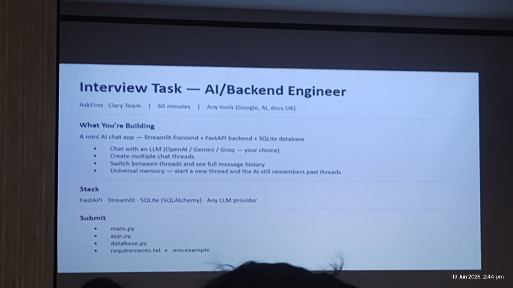

# AskFirst AI

A full-stack AI chat app with persistent memory across conversations. Built with a FastAPI backend and Streamlit frontend, supporting multiple LLM providers.



---

## Features

- Multi-turn chat with conversation threads
- Persistent universal memory — the AI remembers facts about you across all chats (name, location, preferences, etc.)
- Streaming responses
- Multiple LLM provider support: OpenRouter, OpenAI, Groq, Gemini
- SQLite storage for threads, messages, and memory
- Clean, minimal UI

---

## Stack

| Layer    | Tech                          |
|----------|-------------------------------|
| Frontend | Streamlit                     |
| Backend  | FastAPI + Uvicorn             |
| Database | SQLite via SQLAlchemy         |
| LLMs     | OpenRouter / OpenAI / Groq / Gemini |

---

## Quick Start

### 1. Install dependencies

```bash
pip install -r requirements.txt
```

### 2. Configure environment

```bash
cp .env.example .env
```

Edit `.env` and set your API key and preferred provider:

```env
LLM_PROVIDER=openrouter
LLM_MODEL=meta-llama/llama-3.1-8b-instruct:free
OPENROUTER_API_KEY=your_key_here
```

### 3. Run the backend

```bash
uvicorn main:app --reload --port 8000
```

### 4. Run the frontend

In a separate terminal:

```bash
streamlit run app.py
```

Open [http://localhost:8501](http://localhost:8501) in your browser.

---

## LLM Providers

Set `LLM_PROVIDER` in `.env` to one of the following:

| Provider      | Env var              | Default model                              |
|---------------|----------------------|--------------------------------------------|
| `openrouter`  | `OPENROUTER_API_KEY` | `meta-llama/llama-3.1-8b-instruct:free`   |
| `openai`      | `OPENAI_API_KEY`     | `gpt-4o-mini`                              |
| `groq`        | `GROQ_API_KEY`       | `llama3-8b-8192`                           |
| `gemini`      | `GEMINI_API_KEY`     | `gemini-1.5-flash`                         |

OpenRouter is the default and offers free-tier models — get a key at [openrouter.ai/keys](https://openrouter.ai/keys).

---

## Project Structure

```
├── main.py          # FastAPI backend — routes, LLM client, memory distillation
├── app.py           # Streamlit frontend
├── database.py      # SQLAlchemy models and CRUD helpers
├── requirements.txt
├── .env.example     # Environment variable template
└── chat.db          # SQLite database (auto-created on first run)
```

---

## How Memory Works

After each exchange, the backend extracts facts from the conversation (name, job, location, preferences, explicit "remember that..." instructions) and stores them in a `universal_memory` table. These facts are injected into the system prompt for every subsequent chat, across all threads.

Memory persists even if individual threads are deleted.

---

## API Endpoints

| Method   | Path                  | Description              |
|----------|-----------------------|--------------------------|
| `POST`   | `/threads`            | Create a new thread      |
| `GET`    | `/threads`            | List all threads         |
| `GET`    | `/threads/{id}`       | Get thread + messages    |
| `DELETE` | `/threads/{id}`       | Delete a thread          |
| `POST`   | `/chat`               | Send a message (streams) |
